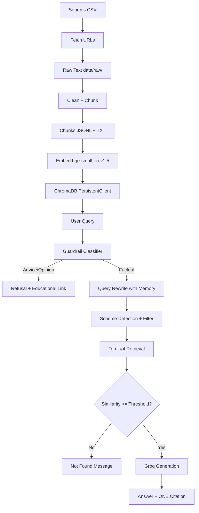

# Architecture: Mutual Fund FAQ RAG Chatbot

## Stack Justification

| Layer | Choice | Why |
|-------|--------|-----|
| Language | Python 3.11+ | Best ecosystem for NLP/ML, all libraries available |
| Ingestion | requests + BeautifulSoup + pypdf | Simple, reliable for HTML and PDF parsing |
| Embeddings | sentence-transformers (BAAI/bge-small-en-v1.5) | Local, free, good quality for English, small (384-dim) |
| Vector Store | ChromaDB PersistentClient | Local, persistent, simple API, metadata filtering |
| Generation | Groq API (groq SDK) | Fast, cheap, OpenAI-compatible, good for short answers |
| UI | Streamlit | Fastest path to a chat UI in Python |
| Config | python-dotenv | Standard .env loading |

## 1. Folder Structure

```
mf-faq-rag/
├── app/
│   └── main.py              # Streamlit UI
├── data/
│   ├── raw/                 # Fetched raw text per source
│   ├── chunks/              # chunks.jsonl, chunks.txt, embeddings_preview.txt
│   ├── chroma/              # Persistent ChromaDB (git-ignored)
│   └── manifest/
│       └── sources.csv      # Source manifest
├── docs/
│   ├── PRD.md
│   ├── architecture.md
│   └── implementation.md
├── scripts/
│   ├── fetch_sources.py     # Phase 1: fetch all URLs
│   ├── chunk_sources.py     # Phase 2: clean + chunk
│   ├── embed_chunks.py      # Phase 3: embed + store in Chroma
│   ├── check_db.py          # Phase 3: verify persistence
│   └── ask.py               # Phase 5: CLI test
├── src/
│   ├── ingest/
│   │   └── fetcher.py       # URL fetching logic
│   ├── chunk/
│   │   └── chunker.py       # Text cleaning + chunking
│   ├── embed/
│   │   └── embedder.py      # Embedding + Chroma storage
│   ├── guardrails/
│   │   └── classifier.py    # Intent classification + refusal
│   ├── retrieve/
│   │   └── retriever.py     # Query rewrite + Chroma retrieval
│   └── generate/
│       └── answer.py        # Groq answer generation
├── tests/
│   └── test_guardrails.py   # Guardrail unit tests
├── .env                     # Secrets (git-ignored)
├── .env.example
├── .gitignore
├── requirements.txt
└── Problemstatement.txt
```

## 2. Data Flow Diagram



## 3. Source Manifest Schema

`data/manifest/sources.csv`:

| Column | Type | Description |
|--------|------|-------------|
| url | string | Full URL |
| scheme | string | Scheme name or "general" |
| doc_type | string | factsheet, sid, kim, scheme_page, investor_education, regulatory |
| publisher | string | hdfcfund.com, sebi.gov.in, amfi.com, amfiindia.com |
| fetched_at | ISO 8601 | When fetched |
| status | string | success, failed |
| notes | string | Error details if failed |

## 4. Chunk Schema and Metadata

Each chunk in `data/chunks/chunks.jsonl`:

```json
{
  "chunk_id": "hdfc_large_cap_factsheet_001",
  "text": "...",
  "source_url": "https://...",
  "scheme": "HDFC Large Cap Fund",
  "doc_type": "factsheet",
  "section": "Scheme Overview",
  "as_of_date": "2025-03-31"
}
```

## 5. Chunking Rules

- **Size**: 500-800 characters per chunk
- **Overlap**: ~100 characters between consecutive chunks
- **Split points**: Headings, then sentences (never mid-sentence if possible)
- **Preserve**: Tables and fee rows kept intact (don't break fee structures)
- **Metadata**: Each chunk tagged with source_url, scheme, doc_type, section, as_of_date

## 6. Guardrail Design

### Intent Classification (rule-based)

| Intent | Patterns | Action |
|--------|----------|--------|
| ADVICE | "should I buy/sell/invest", "is it good", "will it go up", "recommend" | Refuse |
| PORTFOLIO | "my portfolio", "my allocation", "how much should I" | Refuse |
| OPINION | "which is better/best", "which should I pick", "compare and recommend" | Refuse |
| FACTUAL | "expense ratio", "exit load", "minimum SIP", "lock-in", "riskometer", "benchmark", "how to download" | Allow |

### Refusal Template
> "I can only provide factual information from official sources, not investment advice. For educational resources, see: [AMFI/SEBI link]"

### Educational Link List
- AMFI investor education pages
- SEBI investor education pages

## 7. Retrieval Design

- **Top-k**: 4 chunks
- **Scheme filter**: Detect scheme from query (with aliases: "Equity Fund" = Flexi Cap, "Top 100" = Large Cap, "ELSS"/"tax saver" = ELSS Tax Saver)
- **Similarity threshold**: Configurable (default: 0.5 cosine similarity). Below threshold → NOT_FOUND
- **Metadata filtering**: When scheme detected, filter chunks by scheme metadata before scoring

## 8. Memory Design

- Keep last 10 messages in conversation history
- Use them ONLY to rewrite follow-up queries into standalone queries before retrieval
- Example: "what about its exit load?" + context → "What is the exit load of HDFC Small Cap Fund?"
- Memory is NOT passed to the generation prompt (only to query rewrite)

## 9. Answer Prompt Design

### System Prompt Rules
1. Use ONLY the provided context — never use outside knowledge
2. Maximum 3 sentences
3. No investment advice or opinions
4. Do not add any links — the system will append the citation
5. If the context doesn't contain the answer, say "I could not find this in the provided sources."

### User Prompt Template
```
Context:
{retrieved_chunks}

Question: {standalone_query}

Answer (max 3 sentences, facts only):
```

## 10. Config, Secrets, Error Handling, and Test Plan

### Config
- `.env` loaded via python-dotenv
- `GROQ_API_KEY` and `GROQ_MODEL` read from environment
- All config values have defaults in `src/config.py`

### Error Handling
- Groq API failure → friendly error message in UI
- Missing .env → clear setup instructions
- Empty retrieval → "I could not find this in the sources."
- Fetch failures → logged in sources.csv with status=failed

### Test Plan
1. **Unit tests**: Guardrail classifier (20+ cases)
2. **Integration tests**: CLI ask.py with 8 test questions
3. **UI tests**: Manual verification of Streamlit app
4. **Regression**: Full 8-question list after any change
